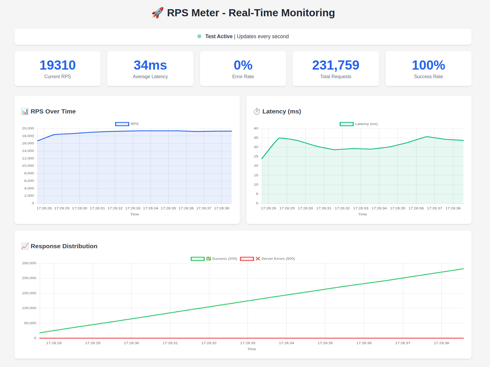
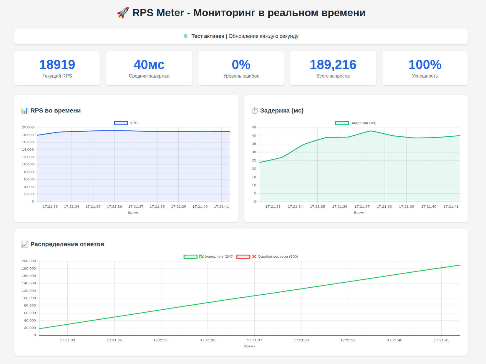

# RPS Meter

🚀 A high-performance HTTP load testing tool with a real-time web dashboard.



## Features

- **High Performance**: Supports 50,000+ RPS
- **Real-time Web Dashboard**: Live graphs and metrics at http://localhost:9090
- **Two Testing Modes**:
  - Simple mode: Single endpoint testing (`/checkout`)
  - Chain mode: Sequential request testing (`/checkout` → `/purchase`)
- **Detailed Statistics**: Latency, RPS, response codes, errors
- **Flexible Configuration**: User count, workers, test duration
- **Automatic Optimization**: Connection pooling, object reuse

## Quick Start

### Compilation

```bash
go build -o rps_meter main.go
```

### Basic Usage

```bash
# Simple checkout test with 1000 RPS for 1 minute
./rps_meter -rps=1000 -duration=1m

# Chain test (checkout→purchase) with 5000 RPS
./rps_meter -rps=5000 -duration=2m -chain=true

# Test with limited users
./rps_meter -rps=100 -users=100 -duration=30s
```

## Command Line Parameters

| Parameter | Type | Default | Description |
|----------|-----|---------|-------------|
| `-rps` | int | 1000 | Target requests per second |
| `-users` | int | 100 | Number of unique users |
| `-duration` | string | 60s | Test duration (30s, 1m, 2h) |
| `-url` | string | http://localhost:8080 | Target server URL |
| `-chain` | bool | false | Test checkout→purchase chain |
| `-workers` | int | 0 | Worker count (0 = auto) |
| `-help` | bool | false | Show help |

## Testing Modes

### 1. Simple Mode (Checkout Only)

Tests single endpoint:
```
POST /checkout?user_id=123&item_id=456
```

**Example:**
```bash
./rps_meter -rps=10000 -duration=2m
```

### 2. Chain Mode (Checkout → Purchase)

Executes two sequential requests:
1. `POST /checkout?user_id=123&item_id=456` → gets code
2. `POST /purchase?code=<uuid>` → completes purchase

**Example:**
```bash
./rps_meter -rps=5000 -duration=3m -chain=true
```

## Web Dashboard

Automatically available at: **http://localhost:9090**

### Dashboard Features:

- **Real-time RPS Graph**: Shows actual load
- **Latency Graph**: Average response time in milliseconds
- **Response Distribution**: Successful vs failed requests
- **Chain Metrics**: Checkout/purchase statistics (chain mode)
- **Key Metrics**: Current RPS, average latency, error rate

## Usage Examples

### Performance Testing

```bash
# Basic load
./rps_meter -rps=1000 -duration=5m

# High load
./rps_meter -rps=10000 -duration=2m -workers=100

# Stress test
./rps_meter -rps=50000 -duration=30s -workers=500
```

### Business Process Testing

```bash
# Full purchase chain
./rps_meter -rps=2000 -duration=10m -chain=true

# Realistic user count
./rps_meter -rps=500 -users=1000 -duration=30m -chain=true
```

### Server Testing

```bash
# Local server
./rps_meter -url=http://localhost:3000 -rps=1000

# Remote server
./rps_meter -url=https://api.example.com -rps=500 -duration=1h
```

## Result Interpretation

### Response Codes

- **200 OK**: Successful requests
- **409 Conflict**: Conflicts (e.g., item already purchased)
- **500 Internal Server Error**: Server errors
- **Timeouts**: Requests exceeding timeout (5 seconds)

### Key Metrics

- **RPS (Requests Per Second)**: Actual load
- **Latency**: Response time (includes full chain in chain mode)
- **Error Rate**: Percentage of 5xx errors
- **Success Rate**: Percentage of successful requests (200 + 409)

## Performance Optimization

### System Settings

For high loads:

```bash
# Increase file descriptor limits
ulimit -n 65536

# Configure TCP parameters
echo 1 > /proc/sys/net/ipv4/tcp_tw_reuse
echo 1 > /proc/sys/net/ipv4/tcp_tw_recycle
```

### Usage Recommendations

- **Workers**: Start with auto-calculation, then tune
- **Users**: Use realistic counts for accurate testing
- **Duration**: 1-2 minutes for warmup, 5+ minutes for stable tests

## Requirements

- **Go**: Version 1.19+
- **Memory**: Minimum 512MB, 2GB+ recommended for high loads
- **CPU**: Multi-core processor for maximum performance
- **Network**: Stable connection to target server

## Architecture

### Components

1. **Load Tester**: Core engine
2. **Workers**: Goroutine pool for request generation
3. **Stats Collector**: Real-time metrics collection
4. **Web Dashboard**: HTTP server for dashboard
5. **Request Pool**: HTTP request reuse

### Optimizations

- **Connection Pooling**: TCP connection reuse
- **Object Pooling**: HTTP request reuse
- **Atomic Operations**: Thread-safe counters
- **Non-blocking I/O**: Asynchronous request handling

## Troubleshooting

### Common Issues

**Too many open files**
```bash
ulimit -n 65536
```

**Low actual RPS**
- Increase worker count
- Check target server performance
- Verify network stability

**High latency**
- Check server load
- Ensure proximity to target service
- Consider reducing RPS

## Development

### Project Structure

```
.
├── main.go           # Core logic
├── README.md         # Documentation
└── examples/         # Usage examples
```


----


# RPS Meter

🚀 Высокопроизводительный инструмент для нагрузочного тестирования HTTP сервисов с веб-дашбордом в реальном времени.



## Особенности

- **Высокая производительность**: Поддержка до 50,000+ RPS
- **Веб-дашборд в реальном времени**: Графики и метрики на http://localhost:9090
- **Два режима тестирования**:
  - Простой режим: тестирование одного эндпоинта (`/checkout`)
  - Цепочка: тестирование связанных запросов (`/checkout` → `/purchase`)
- **Детальная статистика**: Латентность, RPS, коды ответов, ошибки
- **Гибкая настройка**: Количество пользователей, воркеров, длительность теста
- **Автоматическая оптимизация**: Пулы соединений, переиспользование объектов

## Быстрый старт

### Компиляция

```bash
go build -o rps_meter main.go
```

### Базовое использование

```bash
# Простой тест checkout с 1000 RPS на 1 минуту
./rps_meter -rps=1000 -duration=1m

# Тест цепочки checkout→purchase с 5000 RPS
./rps_meter -rps=5000 -duration=2m -chain=true

# Тест с ограниченным количеством пользователей
./rps_meter -rps=100 -users=100 -duration=30s
```

## Параметры командной строки

| Параметр | Тип | По умолчанию | Описание |
|----------|-----|--------------|----------|
| `-rps` | int | 1000 | Целевой RPS (запросов в секунду) |
| `-users` | int | 100 | Количество уникальных пользователей |
| `-duration` | string | 60s | Длительность теста (30s, 1m, 2h) |
| `-url` | string | http://localhost:8080 | URL тестируемого сервера |
| `-chain` | bool | false | Тестировать цепочку checkout→purchase |
| `-workers` | int | 0 | Количество воркеров (0 = автоматически) |
| `-help` | bool | false | Показать справку |

## Режимы тестирования

### 1. Простой режим (Checkout Only)

Тестирует один эндпоинт:
```
POST /checkout?user_id=123&item_id=456
```

**Пример запуска:**
```bash
./rps_meter -rps=10000 -duration=2m
```

### 2. Режим цепочки (Checkout → Purchase)

Последовательно выполняет два связанных запроса:
1. `POST /checkout?user_id=123&item_id=456` → получает код
2. `POST /purchase?code=<uuid>` → выполняет покупку

**Пример запуска:**
```bash
./rps_meter -rps=5000 -duration=3m -chain=true
```

## Веб-дашборд

После запуска автоматически становится доступен дашборд по адресу: **http://localhost:9090**

### Возможности дашборда:

- **График RPS в реальном времени**: Показывает фактическую нагрузку
- **График латентности**: Среднее время ответа в миллисекундах
- **Распределение ответов**: Успешные запросы vs ошибки сервера
- **Метрики цепочки**: Статистика по этапам checkout и purchase (если включен режим цепочки)
- **Ключевые показатели**: Текущий RPS, средняя латентность, уровень ошибок

## Примеры использования

### Тестирование производительности

```bash
# Базовая нагрузка
./rps_meter -rps=1000 -duration=5m

# Высокая нагрузка
./rps_meter -rps=10000 -duration=2m -workers=100

# Стресс-тест
./rps_meter -rps=50000 -duration=30s -workers=500
```

### Тестирование бизнес-процессов

```bash
# Полная цепочка покупки
./rps_meter -rps=2000 -duration=10m -chain=true

# Тест с реальным количеством пользователей
./rps_meter -rps=500 -users=1000 -duration=30m -chain=true
```

### Тестирование разных серверов

```bash
# Локальный сервер
./rps_meter -url=http://localhost:3000 -rps=1000

# Удаленный сервер
./rps_meter -url=https://api.example.com -rps=500 -duration=1h
```

## Интерпретация результатов

### Коды ответов

- **200 OK**: Успешные запросы
- **409 Conflict**: Конфликты (например, товар уже куплен)
- **500 Internal Server Error**: Ошибки сервера
- **Timeouts**: Запросы, превысившие таймаут (5 секунд)

### Ключевые метрики

- **RPS (Requests Per Second)**: Фактическая нагрузка
- **Latency**: Время ответа (включает полную цепочку для режима chain)
- **Error Rate**: Процент ошибок 5xx
- **Success Rate**: Процент успешных запросов (200 + 409)

## Оптимизация производительности

### Настройки системы

Для высоких нагрузок рекомендуется:

```bash
# Увеличить лимиты файловых дескрипторов
ulimit -n 65536

# Настроить TCP параметры
echo 1 > /proc/sys/net/ipv4/tcp_tw_reuse
echo 1 > /proc/sys/net/ipv4/tcp_tw_recycle
```

### Рекомендации по использованию

- **Воркеры**: Начните с автоматического расчета, затем настройте под вашу систему
- **Пользователи**: Для реалистичного тестирования используйте количество, близкое к реальному
- **Длительность**: Для прогрева используйте 1-2 минуты, для стабильного теста — 5+ минут

## Системные требования

- **Go**: версия 1.19 или выше
- **Память**: минимум 512MB, рекомендуется 2GB+ для высоких нагрузок
- **CPU**: многоядерный процессор для максимальной производительности
- **Сеть**: стабильное соединение с тестируемым сервером

## Архитектура

### Компоненты

1. **Load Tester**: Основной движок нагрузки
2. **Workers**: Пул горутин для генерации запросов
3. **Stats Collector**: Сбор метрик в реальном времени
4. **Web Dashboard**: HTTP сервер для дашборда
5. **Request Pool**: Переиспользование HTTP запросов

### Оптимизации

- **Connection Pooling**: Переиспользование TCP соединений
- **Object Pooling**: Переиспользование HTTP запросов
- **Atomic Operations**: Безопасные операции со счетчиками
- **Non-blocking I/O**: Асинхронная обработка запросов

## Устранение неполадок

### Частые проблемы

**Слишком много открытых файлов**
```bash
ulimit -n 65536
```

**Низкий фактический RPS**
- Увеличьте количество воркеров
- Проверьте производительность целевого сервера
- Убедитесь в стабильности сетевого соединения

**Высокая латентность**
- Проверьте нагрузку на сервер
- Убедитесь в близости к тестируемому сервису
- Рассмотрите уменьшение RPS

## Разработка

### Структура проекта

```
.
├── main.go           # Основной файл с логикой
├── README.md         # Документация
└── examples/         # Примеры использования
```
